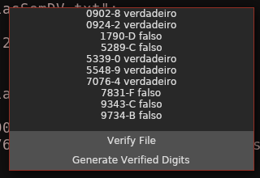

# Horatius

[](https://travis-ci.org/mtrsk/Horatius)
[](https://actions-badge.atrox.dev/mtrsk/Horatius/goto?ref=master)

```
     Then out spake brave Horatius,
          The Captain of the Gate:
     "To every man upon this earth
          Death cometh soon or late.
     And how can man die better
          Than facing fearful odds,
     For the ashes of his fathers,
          And the temples of his gods,
```
[Lays of Ancient Rome - Horatius, XXVII.](https://en.wikisource.org/wiki/Lays_of_Ancient_Rome)

## Structure

```
├── Dockerfile
├── files
│   ├── matriculasSemDV.txt
│   └── matriculasParaVerificar.txt
├── Horatius.sln
├── nix
│   ├── .nixpkgs-version.json
│   └── pinned-nixpkgs.nix
├── README.md
├── shell.nix
└── src
    ├── App
    │   ├── App.fsproj
    │   ├── AppView.fs
    │   ├── Lib.fs
    │   └── Main.fs
    ├── CLI
    │   ├── CLI.fsproj
    │   └── Program.fs
    ├── Verification
    │   ├── Library.fs
    │   └── Verification.fsproj
    └── Verification.Tests
        ├── Program.fs
        ├── Tests.fs
        └── Verification.Tests.fsproj
```

### Source Code

* Verification: A classlib which implements the main components of the project.
* Verification.Test: Runs XUnit tests for the `Verification` classlib.
* CLI: A console application that runs the `Verification` on both the `matriculasSemDV.txt` and `matriculasParaVerificar.txt`.
* App: The GUI Application, mostly boilerplate. Created with the [AvaloniaUI](https://github.com/AvaloniaUI/Avalonia) and [it's wrapper](https://github.com/JaggerJo/Avalonia.FuncUI) for Elm-like MVU GUIs in F#.

#### Running the project

* Tests
    ```sh
    $ cd src/Verification.Tests
    $ dotnet test
    ```

* CLI
    ```sh
    $ cd src/CLI
    $ dotnet build
    $ dotnet run
    USAGE: horatius [--help] [--all]

    OPTIONS:

        --all                 Parses both files and creates new ones.
        --help                display this list of options.
    $ dotnet run --all
    Loading File: ../../files/matriculasSemDV.txt
    File written in the current directory
    Loading File: ../../files/matriculasParaVerificar.txt
    File written in the current directory
    ```

* GUI
    ```sh
    $ cd src/App
    $ dotnet build
    $ dotnet run
    ```

